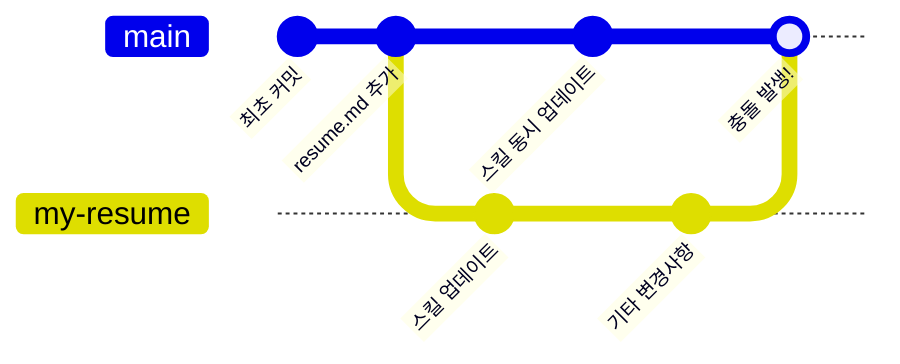

## 1단계: 머지 충돌에 대해 알아보기

### 머지 충돌이란?

**머지 충돌**은 두 개의 서로 다른 브랜치에서 같은 파일의 같은 부분을 수정했을 때 발생합니다.

**무슨 일이 일어나고 있나요:**

1. 저장소를 만들고 `resume.md` 파일을 추가합니다.
2. `my-resume`이라는 새 브랜치를 만들어 스킬 영역을 업데이트합니다.
3. 동시에 다른 사람도 `main` 브랜치에서 스킬 영역을 업데이트합니다.
4. `my-resume` 브랜치에 관련 없는 다른 변경 사항을 추가합니다.
5. `my-resume`을 `main`에 머지하려고 하면 **충돌이 발생합니다!** 두 브랜치 모두 `resume.md`의 같은 부분을 수정했기 때문입니다.

### ⌨️ 활동: 풀 리퀘스트 만들기

빠른 연습을 위해, 이미 `my-resume` 브랜치를 만들고 양쪽 브랜치에서 `resume.md`를 수정하여 충돌이 발생하는 시나리오를 준비해 두었습니다. 함께 연습해 봅시다!

1. 새 브라우저 탭에서 이 저장소를 열고, 두 번째 탭에서 이 탭의 지침을 읽으면서 단계를 진행하세요.

1. 상단 네비게이션에서 **Pull requests** 탭을 선택합니다.

1. **New pull request** 버튼을 클릭하고 다음 설정을 사용합니다:

   - Base: `main`
   - Compare: `my-resume`
   - Title: `머지 충돌 해결하기`

1. 새 풀 리퀘스트가 열리면 Mona가 다음 단계를 안내합니다.
