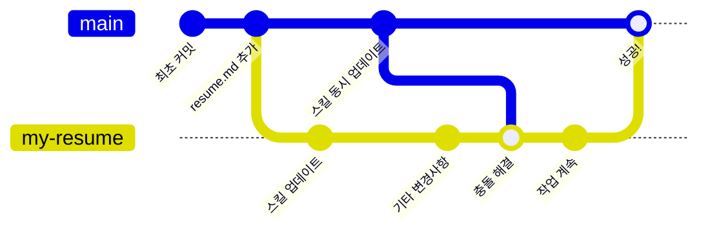

## 2단계: 머지 충돌 해결하기

충돌 관리가 어렵게 느껴질 수 있지만 걱정하지 마세요, Git은 머지를 잘 처리합니다! Git은 상황이 매우 불분명할 때만 사람의 결정이 필요합니다.

일반적으로 충돌을 관리하는 3가지 방법이 있습니다:

1. 베이스 브랜치의 버전을 수용합니다.
1. 비교 브랜치의 버전을 수용합니다.
1. 두 브랜치의 변경 사항을 수동으로 결합합니다.

> [!TIP]
> 충돌 관리에 대해 더 알아보려면 [GitHub 문서: 충돌 해결](https://docs.github.com/en/pull-requests/collaborating-with-pull-requests/addressing-merge-conflicts/resolving-a-merge-conflict-using-the-command-line) 페이지를 참고하세요.

### 충돌은 언제 해결해야 하나요?

충돌은 발견하는 즉시 해결할 수 있습니다. 충돌을 해결해도 GitHub에서 풀 리퀘스트가 자동으로 머지되지는 않습니다. 대신, 충돌 해결이 **역방향 머지** 커밋으로 저장되어 브랜치에서 정상적으로 작업을 계속할 수 있습니다.

이는 `base` 브랜치(`main`)의 일부 변경 사항이 `compare` 브랜치(`my-resume`)로 머지된다는 의미입니다. `compare` 브랜치만 업데이트되므로, 머지하기 전에 해결된 변경 사항을 테스트할 수 있습니다.



### ⌨️ 활동: 머지 충돌 해결하기

1. 필요하다면 최근에 만든 풀 리퀘스트를 엽니다.

1. 페이지 하단으로 스크롤합니다. 머지 버튼 근처에 해결해야 할 충돌이 있다는 메시지가 표시됩니다.

1. **Resolve conflicts** 버튼을 눌러 머지 충돌을 처리하는 특수 텍스트 편집기를 엽니다.

1. 아래와 유사하게 두 버전의 충돌을 보여주는 강조 표시된 섹션을 찾습니다.

   ```txt
   <<<<<<< my-resume
   - Contributed to open source projects
   =======
   - Built internal tools
   >>>>>>> main
   ```

1. 검토 후 비교 브랜치의 버전을 유지하기로 결정합니다. `=======`과 `>>>>>>> main` 사이의 내용을 삭제하여 베이스 브랜치 버전을 제거합니다.

   ```txt
   <<<<<<< my-resume
   - Contributed to open source projects
   =======
   >>>>>>> main
   ```

1. 수동 변경이 끝났으면, 머지 충돌 마커를 제거합니다. 비교 브랜치의 내용만 남게 됩니다.

   ```txt
   - Contributed to open source projects
   ```

1. 우측 상단에서 **Mark as resolved** 버튼을 클릭하고 **Commit merge**를 선택합니다.

1. 충돌이 해결되면 Mona가 다음 단계를 안내합니다.
